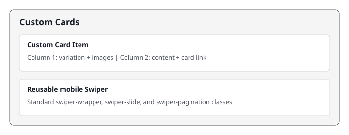

# Custom Cards

The Custom Cards block displays fixed-state Insights & Impact cards in a desktop row and a Swiper carousel on mobile.

## Universal Editor — Authoring View

The screenshot below shows the **properties panel** authors see in the Universal Editor when they click to edit this block.



---

## Authoring

The container has no authored fields. Add one or more Custom Card child items.

### Custom Card Item

| Field | Type | Description |
|---|---|---|
| Card Variation | Multi Select | Grouped into column 1; Featured applies the fixed red treatment. |
| Image 1 | Reference | Fixed display artwork for the card. |
| Image 1 Alt Text | Text | Describe the image, or leave empty only when decorative. |
| Image 2 | Reference | Optional legacy image; it is not displayed. |
| Image 2 Alt Text | Text | Describe Image 2 when it conveys information. |
| Title | Text | Card heading. |
| Description | Rich Text | Card supporting copy. |
| Card Link | AEM Content | Destination opened by the circular card action. |
| Card Link Text | Text | Accessible label for the card action link. |

The item renders as two authored columns: variation and images in column 1, then badge, title, description, and card link in column 2. Card colors and artwork do not change on hover.

## Responsive Behaviour

| Breakpoint | Behaviour |
|---|---|
| Mobile (< 900px) | 280 x 260 cards use Swiper with accessible pagination. |
| Desktop (>= 900px) | Three 356px cards display in one row; Featured is 382px tall. |

## File Structure

```text
blocks/custom-cards/
|-- custom-cards.css
|-- custom-cards.js
|-- _custom-cards.json
|-- MAPPING-README.md
|-- README.md
`-- docs/
    `-- ue-authoring.svg
```
