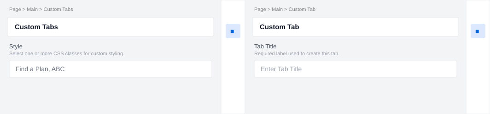

# Custom Tabs

Custom Tabs turns titled sections following the block into an accessible tab interface with
independently authored panel content.

## Universal Editor — Authoring View

The screenshot below shows the **properties panel** authors see in the Universal Editor when they
click to edit this block.



---

## Authoring

Add `Custom Tab` sections after the `custom-tabs` block and place components inside each section.

| Field | Type | Description |
|---|---|---|
| Style | Select | Select one or more CSS classes for custom styling. |
| Tab Title | Text | Required label used to create the tab. |

## Responsive Behaviour

| Breakpoint | Behaviour |
|---|---|
| Mobile (< 900px) | Tab labels act as accordion controls; panels open below their labels. |
| Desktop (≥ 900px) | Horizontal tab navigation displays one panel at a time. |

## File Structure

```text
blocks/custom-tabs/
├── custom-tabs.css
├── custom-tabs.js
├── _custom-tabs.json
├── README.md
├── MAPPING-README.md
└── docs/
    └── ue-authoring.svg
```